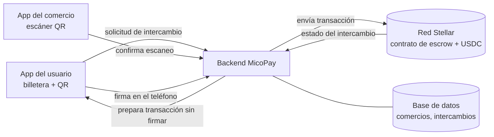

# Product Blueprint

**Nombre del proyecto:** MicoPay — cambiar dólares digitales por pesos en efectivo con alguien de tu colonia.

**Repositorio (enlace obligatorio):** [ProyectoBase](https://github.com/vallejoraul08-debug/ProyectoBase)

---

## Contenido

1. Priorización de historias
2. Propuesta de valor
3. Flujo de usuario
4. Alcance del MVP
5. Lean Canvas
6. Backlog priorizado (Kanban)
7. Arquitectura inicial
8. Uso de Stellar y justificación

---

## 1. Priorización de historias

**Criterio de priorización:** MoSCoW. *Imprescindible* = sin esa historia no se puede probar la hipótesis del Problem Brief (intercambio sin que nadie confíe primero). *Debería* = protege o facilita el intercambio, pero el flujo central corre sin ella. *Podría* = mejora la experiencia y puede hacerse a mano en el piloto.

| Prioridad | Historia | Propuesta por | Por qué entra al backlog |
| :---: | --- | :---: | --- |
| 1 | Como usuario que cambia dinero con un desconocido quiero que mis USDC queden retenidos en un escrow y solo se liberen al comercio cuando yo confirme que recibí el efectivo para no tener que confiar primero en la otra persona. | Raúl Vallejo | Imprescindible. Es la hipótesis central: elimina el riesgo del cambio informal. |
| 2 | Como receptor de remesas sin cuenta bancaria quiero cambiar mis USDC por pesos en efectivo en un comercio a pocas cuadras de mi casa para no ir a una sucursal ni perder cerca de 5% en comisiones. | Raúl Vallejo | Imprescindible. Es el resultado que busca el usuario principal. |
| 3 | Como comerciante quiero escanear el código QR del usuario al entregar el efectivo para cobrar mis USDC en ese momento, sin conciliar pagos a mano. | Raúl Vallejo | Imprescindible. Cierra el intercambio del lado del comercio. |
| 4 | Como usuario quiero que, si el comercio no me entrega el efectivo dentro del plazo, mis USDC regresen solos a mi billetera para no perder mi dinero. | Raúl Vallejo | Debería. Sin devolución automática el escrow solo traslada el riesgo. |
| 5 | Como usuario quiero ver los comercios cercanos con su comisión y su historial de intercambios completados para elegir el más barato y confiable. | Raúl Vallejo | Debería. Da la reputación verificable que permite elegir entre desconocidos. |

*(Pendiente: sumar las historias del resto del equipo y repriorizar en conjunto.)*

---

## 2. Propuesta de valor

**Usuario (del Problem Brief):** receptor de remesas o persona sin cuenta bancaria en México que recibe dólares digitales y necesita pesos en efectivo para gastos del día. Del otro lado, el comerciante de barrio con efectivo parado en caja.

**Resultado que obtiene:** cambia sus dólares por efectivo a unas cuadras de su casa en unos minutos, pagando una comisión de 1.9–2.5% que fija cada comercio, en lugar de perder cerca de 5.5% entre tipo de cambio y comisiones en una ventanilla de remesas.

**Por qué elegiría esta solución:** porque no tiene que confiar en nadie. Sus dólares quedan retenidos y solo pasan al comercio cuando él confirma que ya tiene el efectivo en la mano; si el comercio no cumple a tiempo, el dinero regresa solo. Además ve el historial de intercambios completados de cada comercio antes de elegir.

**En qué se diferencia de cómo lo resuelve hoy:** la ventanilla es segura pero cara, lejana y con topes y vencimientos (en OXXO, $3,000 MXN por referencia y 48 h). El banco exige una cuenta que este usuario no tiene. El cambio informal es barato pero obliga a una de las partes a mandar primero sin a quién reclamar. MicoPay mantiene el precio y la cercanía del cambio entre personas y le quita el riesgo. Para el comerciante, convierte el efectivo ocioso en ingreso por comisión sin comprar equipo ni pagar renta.

---

## 3. Flujo de usuario

Flujo de cambio de USDC a efectivo (cash-out). Roles: **usuario** (vende USDC, recibe efectivo) y **comercio** (entrega efectivo, recibe USDC).

| Paso | Rol | Qué hace | Punto de interacción |
| :---: | :---: | --- | --- |
| 1 | Usuario | Crea su billetera desde el teléfono y recibe USDC (por ejemplo, la remesa de un familiar). | App móvil, billetera Stellar |
| 2 | Usuario | Abre el mapa, compara comercios cercanos por comisión y por número de intercambios completados, y elige uno. | App móvil (mapa) |
| 3 | Usuario | Captura el monto en pesos, ve cuántos USDC se bloquean con la comisión incluida y confirma. Firma la operación en su teléfono. | App móvil, firma en billetera |
| 4 | Sistema | Los USDC quedan retenidos en el contrato de escrow con un plazo de vencimiento. El comercio recibe la solicitud. | Red Stellar (contrato Soroban) |
| 5 | Usuario | Va al comercio y recibe el efectivo en mano. | Presencial |
| 6 | Usuario | Muestra en su app el código QR de un solo uso, que solo aparece mientras el intercambio está activo. | App móvil (QR) |
| 7 | Comercio | Escanea el QR. El contrato libera los USDC a la billetera del comercio. | App del comercio, red Stellar |
| 8 | Ambos | Ven el intercambio como completado; queda registrado en la red y suma al historial del comercio. | App móvil, explorador de la red |
| 8b | Sistema | Si el plazo vence sin escaneo, el contrato devuelve los USDC al usuario. | Red Stellar (contrato Soroban) |

---

## 4. Alcance del MVP

| Dentro del MVP (funcionalidad central) | Fuera del MVP (deseable, para después) |
| --- | --- |
| Billetera Stellar creada desde el teléfono, con saldo en USDC. | Cambio en sentido contrario: depositar efectivo para recibir USDC (cash-in). |
| Escrow en Soroban: bloqueo de USDC, liberación al comercio por QR y devolución automática al vencer. | Retiro a cuenta bancaria o SPEI mediante un anchor. |
| Lista o mapa de comercios con comisión y conteo de intercambios completados. | Calificaciones, reseñas y resolución de disputas con un tercero. |
| Comisión configurable por comercio (1.9–2.5%). | Panel del comercio con reportes, historial y notificaciones. |
| Un solo par (USDC ↔ MXN) y una sola zona piloto. | Ahorro en CETES tokenizados y otros productos de inversión. |

**Por qué el recorte sigue entregando valor:** el MVP cubre completo el momento que hoy falla: dos personas que no se conocen cambian dólares por efectivo sin que ninguna tenga que confiar primero. Con eso ya se puede comprobar la hipótesis con usuarios reales: si el usuario completa el intercambio, si el comercio cobra al momento y si la devolución automática funciona cuando algo sale mal. El cash-in, la salida a banco y los productos de ahorro amplían el mercado, pero no cambian la pregunta que hay que contestar primero. Una sola zona piloto permite reclutar a mano los primeros comercios y medir si vuelven a operar, que es la señal de que el modelo le sirve al lado de la oferta.

---

## 5. Lean Canvas

**Enlace al Lean Canvas (obligatorio):** [Lean Canvas del proyecto](https://escriban-aqui-el-enlace)

*(Pendiente: pasar este contenido a una imagen o lienzo y enlazarlo.)*

| Bloque | Contenido |
| --- | --- |
| Problema | 1) Cobrar dólares digitales en efectivo cuesta 4–6% y exige ir a una sucursal. 2) Sin cuenta bancaria no hay alternativa formal. 3) El cambio informal entre personas es barato pero obliga a confiar primero. |
| Segmento de usuarios | Receptores de remesas y personas sin cuenta bancaria en México; trabajadores que cobran en dólares. Del lado de la oferta: tienditas, farmacias y cafés con efectivo en caja. Primeros usuarios: una zona piloto con comercios reclutados a mano. |
| Propuesta de valor única | Tu dinero, cerca de ti: cambia dólares por efectivo con un comercio de tu colonia sin que nadie tenga que confiar primero. |
| Solución | Escrow que retiene los USDC hasta la entrega en mano; QR de un solo uso para liberar; devolución automática al vencer; historial público de intercambios por comercio. |
| Canales | Comercios de barrio como punto de contacto; recomendación entre familiares que envían remesas; grupos de mensajería donde hoy se hace el cambio informal. |
| Métricas clave | Intercambios completados por semana; porcentaje de intercambios que terminan en devolución; comercios que repiten operación; tiempo del flujo completo. |
| Ventaja diferencial | Red física de comercios con efectivo y reputación verificable que ninguna empresa puede editar. |
| Estructura de costos | Desarrollo y auditoría del contrato; comisiones de red (mínimas); reclutamiento y capacitación de comercios; soporte. |
| Fuentes de ingreso | Comisión de plataforma por intercambio (0.8%) además de la comisión que cobra cada comercio. |

---

## 6. Backlog priorizado (Kanban)

**Enlace al tablero (obligatorio):** [Tablero Kanban en GitHub Projects](https://github.com/users/vallejoraul08-debug/projects/1)

Columnas: Backlog / Por hacer / En progreso / Hecho. Cada tarjeta es una historia de la sección 1 con su prioridad (Imprescindible / Debería) y sus criterios de aceptación.

---

## 7. Arquitectura inicial

**Diagrama:**

| Capa | Componente | Qué hace |
| :---: | --- | --- |
| Interfaz | App móvil web (usuario y comercio) | Muestra el mapa, captura el monto, firma con la llave que vive en el teléfono, muestra y escanea el QR. |
| Lógica | Backend (API) y base de datos | Guarda comercios, comisiones e intercambios; calcula montos; genera el QR de un solo uso; arma las transacciones sin firmar y las envía a la red. No custodia fondos. |
| Stellar | Contrato de escrow en Soroban, activo USDC, cuentas Stellar | Retiene los USDC, los libera al comercio o los devuelve al usuario al vencer, y deja el registro público de cada intercambio. |

**En qué punto entra la red:** en tres momentos. Al bloquear, cuando el usuario firma y los USDC pasan de su cuenta al contrato. Al liberar, cuando el comercio escanea el QR y el contrato transfiere los USDC a su cuenta. Al devolver, cuando vence el plazo y el contrato regresa los fondos al usuario. Todo lo demás (mapa, búsqueda de comercios, cálculo de montos) vive fuera de la red, para que la app sea rápida y barata de operar. El backend coordina, pero no puede mover los fondos por su cuenta: cada movimiento lo autoriza la firma del usuario o la regla del contrato.

---

## 8. Uso de Stellar y justificación

**Criterio de pertinencia (del Problem Brief):** se elimina un intermediario que hoy concentra la confianza, y partes que no se conocen comparten un histórico que no se puede alterar.

| Componente de Stellar | Para qué lo usamos | Por qué ese y no otra alternativa |
| --- | --- | --- |
| Contrato inteligente en Soroban (escrow) | Retener los USDC del usuario y liberarlos solo con la confirmación de entrega, o devolverlos al vencer. | Reemplaza al intermediario de confianza: la regla está en código público y nadie, ni MicoPay, puede quedarse con los fondos. Una base de datos propia obligaría al usuario a confiar en la empresa. |
| USDC en Stellar | El dólar digital que recibe el usuario y que cobra el comercio. | Es una stablecoin con reservas 1:1 y redención en dólares; el comercio cobra en un activo estable, no en una cripto volátil. |
| Cuentas y firma en el dispositivo | Que cada persona controle su propia llave y autorice cada movimiento. | Permite operar sin cuenta bancaria; la billetera se crea en segundos desde el teléfono. |
| Registro público de la red | Guardar cada intercambio completado como historial del comercio. | El historial no lo puede editar ni borrar ninguna empresa: es la reputación verificable entre desconocidos. |
| Comisiones bajas y confirmación en segundos | Que el intercambio cueste centavos y se confirme mientras el usuario está en el mostrador. | En redes con comisiones altas o lentas, el costo de la transacción se comería el ahorro frente a la ventanilla de remesas. |
